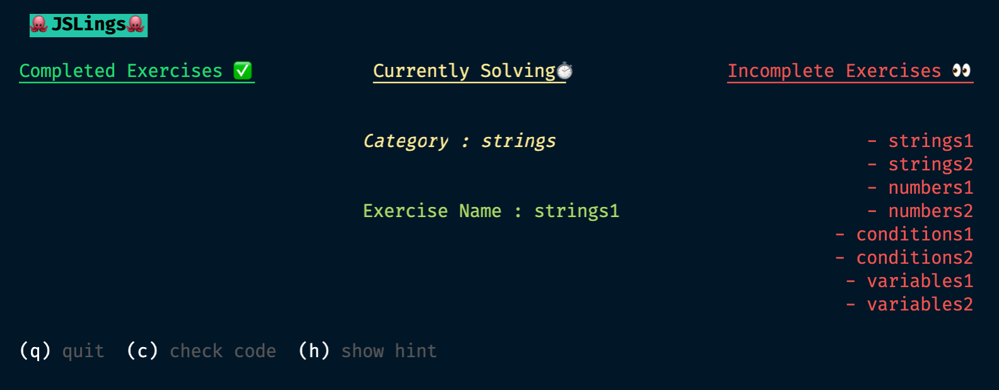
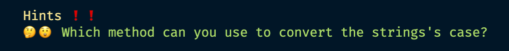

# jslings 🐙

Hello friends!

Welcome to `jslings`, an interactive command line tool that guides you through the ins and outs of JavaScript, one exercise at a time.



## Getting Started

Clone the repository to your local machine, install the dependencies, and fill your brain with knowledge!

```bash
git clone https://github.com/XifeiNi/jslings.git
cd jslings
yarn
yarn jslings watch
```

## Completing the Exercises

All exercises can be found in `jslings/exercises/<concept>`. For every topic we have multiple exercises for you to learn from basic to advanced.

Each exercises comes with some tests (`jslings/src/__tests__/` for the curious). The CLI tool runs those tests to make sure your code does what it's supposed to. To start learning, simply run:

```bash
yarn jslings watch
```

From there, you'll see our command line interface. You can press `c` to test your code and update your progress as you move along!

## Getting Hints

We've includes some hints for each exercises. Once you've started the `jslings` CLI, you can simply press `h` to receive a hint for the exercise you're currently on. Pressing `h` multiple times will cycle through the hints we have provided.



## Contributing Guide

We welcome PRs to improve `jslings` and make it the best educational tool for learning Javascript!

### Tests

The current code base allows you to add tests using `yarn generate`, this creates exercise as well as test files. To add your tests into `jslings`, all you have to do is -

1. Create a function(with appropriate inputs) and export it from the js file
2. Write a test for the function in the `__tests__` folder
3. Fire up your custom `jslings`! 🔥

P.S. If you'd like to see your tests added into `jslings`, feel free to submit PRs and label them as `tests`

### CLI

The CLI is made using [`ink`](https://www.npmjs.com/package/ink) and we use [`jest`](https://www.npmjs.com/package/jest) for all our testing.

Before submitting the PRs for CLI and other things not related to tests, please label them as `dev`
